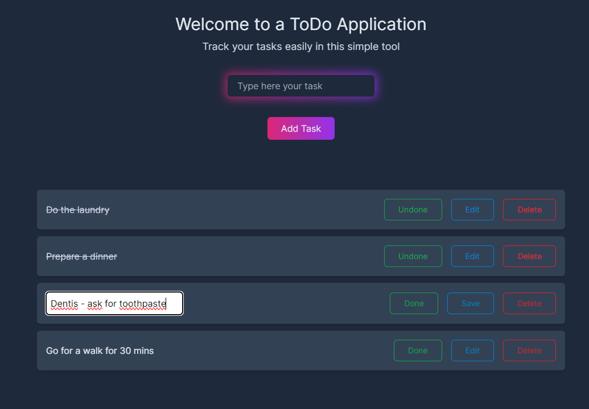

# ToDo app



### Description

Written in Next.js simple ToDo application, to test Reacts' Next.js framework.
In project I've used `useState` and `useEffect`, to test how does it work. 

### Features

- Create task,
- Mark task as done/undone,
- Edit task,
- Delete task,
- Store tasks in Local Storage after the page refresh.

### Installation

1. Clone repository:

```bash
git clone https://github.com/peroxovy/todo.git
```

2. Enter the project directory:

```bash
cd todo
```

3. Install dependencies:

```bash
npm install
```

4. Run development server:

```bash
npm run dev
```

5. Enter the page in the browser:

`http://localhost:3000/ `

### Tech Stack

- [Next.js](https://nextjs.org/),
- [TailwindCSS](https://tailwindcss.com/),